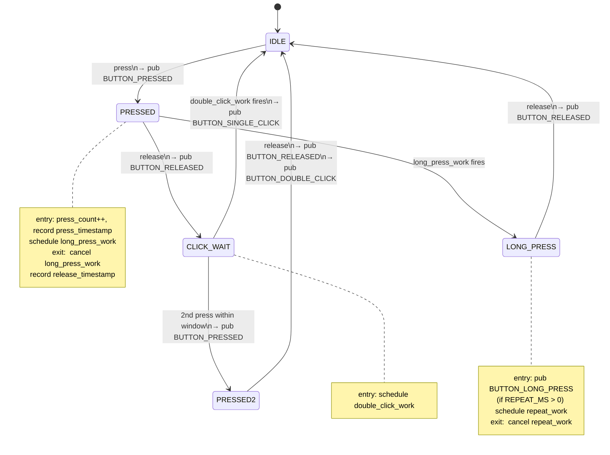

# Button Module Specification

## Document Information

| Field | Value |
|-------|-------|
| Module | `zego/button` |
| Version | 2026-06-02-11-38 |
| PRD Version | N/A (standalone library module) |
| Status | Stable |

---

## Changelog

| Version | Summary of changes |
|---|---|
| 2026-05-31-00-00 | Initial module spec (3-state FSM: IDLE/PRESSED/RELEASED) |
| 2026-06-01-08-54 | 5-state FSM: added BUTTON_SINGLE_CLICK, BUTTON_DOUBLE_CLICK, BUTTON_LONG_PRESS gesture classification; BUTTON_PRESSED / BUTTON_RELEASED raw events retained; long-press default 3000 ms |
| 2026-06-01-12-10 | Removed duplicate second half of spec; removed Migrating section; DOUBLE_CLICK_WINDOW_MS default changed to 300 ms |
| 2026-06-01-11-04 | Added Supported Hardware section (nRF7002DK, nRF54LM20DK); corrected nRF54LM20DK default NUM_BUTTONS to 4; documented shield/application constraint for BUTTON3; fixed LONG_PRESS_MS default in Configuration table (3000 ms) |
| 2026-06-01-13-27 | Removed test folder; updated Location and Testing sections accordingly |
| 2026-06-02-11-38 | Hardware abstraction layer (`button_hw.h` + DK / gpio-keys backends); long-press repeat (`CONFIG_ZEGO_BUTTON_LONG_PRESS_REPEAT_MS`); documented PRESSED2 no-long-press design; added `long_press_exit` to state table; updated test-shim API |

---

## Overview

The `zego/button` module monitors hardware buttons using a per-button Zephyr SMF
state machine.  It publishes two layers of events on `BUTTON_CHAN` (zbus):

- **Raw events** (`BUTTON_PRESSED`, `BUTTON_RELEASED`) — fired immediately on every
  physical press and release.
- **Gesture events** (`BUTTON_SINGLE_CLICK`, `BUTTON_DOUBLE_CLICK`, `BUTTON_LONG_PRESS`)
  — fired after the FSM classifies the press sequence using configurable timers.

Subscribers may listen to either layer, or both.  The module does **not** drive LEDs,
manage connectivity state, or contain any application-specific logic.

A **hardware abstraction layer** (`button_hw.h`) decouples the FSM from the physical
button driver.  Choose a backend via Kconfig:

| Backend | Kconfig symbol | Description |
|---------|----------------|-------------|
| DK library (default) | `CONFIG_ZEGO_BUTTON_BACKEND_DK=y` | Uses `dk_buttons_and_leds`; works out-of-the-box on nRF7002DK and nRF54LM20DK |
| Zephyr Input | `CONFIG_ZEGO_BUTTON_BACKEND_GPIO=y` | Uses `gpio-keys` + Zephyr Input subsystem; portable to any board with a `gpio-keys` DTS node |

---

## Supported Hardware

| Board | Build target | Buttons available | Notes |
|-------|-------------|-------------------|-------|
| nRF7002DK | `nrf7002dk/nrf5340/cpuapp` | Button 1 (idx 0), Button 2 (idx 1) | 2 buttons |
| nRF54LM20DK (standalone) | `nrf54lm20dk/nrf54lm20a/cpuapp` | BUTTON0–BUTTON3 (idx 0–3) | 4 buttons |
| nRF54LM20DK + nRF7002EB2 | `nrf54lm20dk/nrf54lm20a/cpuapp` + `-DSHIELD=nrf7002eb2` | BUTTON0–BUTTON2 (idx 0–2) | BUTTON3 pin conflicts with the shield — **application constraint**, not a module limitation. The module itself always supports 4 buttons; override `CONFIG_ZEGO_BUTTON_NUM_BUTTONS=3` in the application's `boards/nrf54lm20dk_nrf54lm20a_cpuapp.conf` when building with the shield. |

---

## Location

- **Path**: `zego/button/`
- **Files**: `src/button.c`, `src/button.h`, `src/button_hw.h` (HAL interface),
  `src/button_hw_dk.c` (DK backend), `src/button_hw_gpio.c` (gpio-keys backend),
  `Kconfig`, `CMakeLists.txt`, `zephyr/module.yml`, `sample/`, `docs/`

---

## Module Type

- [x] **Application module** — SMF per-button state machine, driven by hardware backend callback on the system work queue; publishes to `BUTTON_CHAN` (zbus).

---

## Zbus Integration

**Publishes to**: `BUTTON_CHAN`

```c
enum button_msg_type {
    BUTTON_PRESSED,      /* Raw: fired immediately on press.    duration_ms = 0        */
    BUTTON_RELEASED,     /* Raw: fired immediately on release.  duration_ms = hold time */
    BUTTON_SINGLE_CLICK, /* Gesture: confirmed after double-click window expires        */
    BUTTON_DOUBLE_CLICK, /* Gesture: two presses within DOUBLE_CLICK_WINDOW_MS          */
    BUTTON_LONG_PRESS,   /* Gesture: held >= LONG_PRESS_MS; fires while still held      */
};

struct button_msg {
    enum button_msg_type type;
    uint8_t  button_number; /* 0-based button index                              */
    uint32_t duration_ms;   /* Hold time in ms; semantics depend on type (below) */
    uint32_t press_count;   /* Cumulative physical-press count for this button   */
    uint32_t timestamp;     /* k_uptime_get_32() at publication time             */
};
```

**`duration_ms` semantics:**

| Event type           | `duration_ms` value                                  |
|----------------------|------------------------------------------------------|
| `BUTTON_PRESSED`     | Always 0                                             |
| `BUTTON_RELEASED`    | Hold time: `release_ms − press_ms`                   |
| `BUTTON_SINGLE_CLICK`| Hold time of the press (same as the preceding BUTTON_RELEASED) |
| `BUTTON_DOUBLE_CLICK`| Hold time of the 2nd press                          |
| `BUTTON_LONG_PRESS`  | `CONFIG_ZEGO_BUTTON_LONG_PRESS_MS`                   |

**Subscribes to**: nothing — driven entirely by the hardware backend (`button_hw_init` callback).

---

## State Machine

Each button has an independent FSM.  Two `k_work_delayable` timers deliver timer
events by setting a flag and calling `smf_run_state()` on the system work queue
(the same queue as the DK callback) — no mutex is needed.



**State descriptions:**

| State | Description | Entry action | Exit action |
|-------|-------------|--------------|-------------|
| `IDLE` | Waiting for a press | — | — |
| `PRESSED` | Button held; awaiting release or long-press timer | `press_count++`, record `press_timestamp`, schedule `long_press_work`, pub `BUTTON_PRESSED` | Cancel `long_press_work`, record `release_timestamp` |
| `CLICK_WAIT` | First release detected; waiting for 2nd press or timeout | Schedule `double_click_work` | — |
| `PRESSED2` | Second press detected within window. **Note:** holding the 2nd press does not trigger `BUTTON_LONG_PRESS` — the PRESSED2 state has no long-press timer by design. | `press_count++`, record `press_timestamp`, pub `BUTTON_PRESSED` | — |
| `LONG_PRESS` | Button held past long-press threshold | Pub `BUTTON_LONG_PRESS`; if `REPEAT_MS > 0`, schedule `repeat_work` | Cancel `repeat_work` |

**Timer summary:**

| Timer | Scheduled in | Fires after | Effect |
|-------|-------------|-------------|--------|
| `long_press_work` | `PRESSED` entry | `CONFIG_ZEGO_BUTTON_LONG_PRESS_MS` | Sets `long_press_fired`; runs SMF |
| `double_click_work` | `CLICK_WAIT` entry | `CONFIG_ZEGO_BUTTON_DOUBLE_CLICK_WINDOW_MS` | Sets `click_timeout`; runs SMF |
| `repeat_work` | `LONG_PRESS` entry (only when `REPEAT_MS > 0`) | `CONFIG_ZEGO_BUTTON_LONG_PRESS_REPEAT_MS` | Re-publishes `BUTTON_LONG_PRESS`; reschedules itself |

---

## Kconfig Flags

| Symbol | Type | Default | Description |
|--------|------|---------|-------------|
| `CONFIG_ZEGO_BUTTON` | bool | `n` | Enable the module |
| `CONFIG_ZEGO_BUTTON_BACKEND_DK` | bool | `y` | Hardware backend: `dk_buttons_and_leds` (default) |
| `CONFIG_ZEGO_BUTTON_BACKEND_GPIO` | bool | `n` | Hardware backend: Zephyr Input / `gpio-keys` (portable) |
| `CONFIG_ZEGO_BUTTON_NUM_BUTTONS` | int | `4` | Number of buttons; board conf overrides |
| `CONFIG_ZEGO_BUTTON_LONG_PRESS_MS` | int | `3000` | Hold time (ms) that triggers `BUTTON_LONG_PRESS` |
| `CONFIG_ZEGO_BUTTON_DOUBLE_CLICK_WINDOW_MS` | int | `300` | Max gap (ms) between two presses for double-click |
| `CONFIG_ZEGO_BUTTON_LONG_PRESS_REPEAT_MS` | int | `0` | Re-fire `BUTTON_LONG_PRESS` every N ms while held; `0` = disabled |
| `CONFIG_ZEGO_BUTTON_INIT_PRIORITY` | int | `90` | `SYS_INIT` APPLICATION level priority |
| `CONFIG_ZEGO_BUTTON_LOG_LEVEL` | choice | `info` | Log verbosity |

Board-specific defaults (`boards/<board>.conf`):

| Board | `NUM_BUTTONS` | Notes |
|-------|--------------|-------|
| `nrf7002dk/nrf5340/cpuapp` | 2 | Button 1, Button 2 |
| `nrf54lm20dk/nrf54lm20a/cpuapp` | 4 | BUTTON0–BUTTON3; override to 3 in the application when building with `-DSHIELD=nrf7002eb2` |

---

## API / Public Interface

```c
/* Declared in src/button.h; available to subscribers */

/* Channel declaration — subscribe with ZBUS_CHAN_ADD_OBS */
ZBUS_CHAN_DECLARE(BUTTON_CHAN);

/* Test builds only (CONFIG_ZTEST) */
void zego_button_inject(uint8_t btn_num, bool pressed);
void zego_button_inject_long_press_timer(uint8_t btn_num);
void zego_button_inject_long_press_repeat_timer(uint8_t btn_num);
void zego_button_inject_double_click_timer(uint8_t btn_num);
```

**Integration pattern:**

```c
#include "button.h"

static void on_button(const struct zbus_channel *chan)
{
    const struct button_msg *msg = zbus_chan_const_msg(chan);

    switch (msg->type) {
    case BUTTON_SINGLE_CLICK:
        /* short action */
        break;
    case BUTTON_DOUBLE_CLICK:
        /* double-click action */
        break;
    case BUTTON_LONG_PRESS:
        /* long-press action (fires while button still held) */
        break;
    default:
        break; /* ignore raw BUTTON_PRESSED / BUTTON_RELEASED if not needed */
    }
}

ZBUS_LISTENER_DEFINE(my_listener, on_button);
ZBUS_CHAN_ADD_OBS(BUTTON_CHAN, my_listener, 0);
```

Register the module in `CMakeLists.txt` before `find_package(Zephyr ...)`:

```cmake
get_filename_component(ZEGO_BUTTON_DIR ${CMAKE_CURRENT_SOURCE_DIR}/../zego/button REALPATH)
list(APPEND EXTRA_ZEPHYR_MODULES ${ZEGO_BUTTON_DIR})
```

Enable in `prj.conf`:

```
CONFIG_ZEGO_BUTTON=y
```

---

## Error Handling

| Error Condition | Detection | Response |
|----------------|-----------|----------|
| `button_hw_init` fails | Non-zero return in `button_module_init` | `LOG_ERR`, return error code (boot continues) |
| `zbus_chan_pub` fails | Non-zero return in `publish_event` | `LOG_ERR`, event dropped |
| SMF `smf_run_state` fails | Non-zero return in `button_handler` or timer callbacks | `LOG_ERR`, FSM left in current state |
| Out-of-range button inject | `btn_num >= NUM_BUTTONS` in test shim | `LOG_WRN`, silently ignored |

---

## Memory Estimate

| Resource | Value | Notes |
|----------|-------|-------|
| Flash | ~2 KB | Code + read-only state table |
| RAM (static) | ~`NUM_BUTTONS × 80` bytes | Per-button `button_sm_object` structs |
| Stack | None | Runs on system work queue (no dedicated thread) |

---

## Test Points

| Scenario | UART log expected | Pass condition |
|----------|-------------------|----------------|
| Module init | `[zego_button] Initializing zego_button (N buttons)` | Always on boot |
| Module init complete | `[zego_button] zego_button initialized` | Always on boot |
| Press detected | `[zego_button] Button N press #M` | Each physical press |
| Single click | `[zego_button] Button N single click (X ms)` | After double-click window expires |
| Double click | `[zego_button] Button N double click` | On 2nd release within window |
| Long press | `[zego_button] Button N long press` | After `LONG_PRESS_MS` while held |
| zbus publish error | `[zego_button] Failed to publish btn event ...` | On zbus timeout (should not occur) |

---

## Testing

### Hardware (real board)

Build and flash `sample/` on a supported board, then follow the step-by-step
test protocol in [`sample/README.md`](../sample/README.md).

| Step | Action | nRF7002DK button | nRF54LM20DK button | Expected event |
|------|--------|------------------|--------------------|----------------|
| T1 × 3 | Single click | Button 1 | BUTTON0 | `SINGLE_CLICK`, count+1 each |
| T2 × 3 | Double click | Button 1 | BUTTON0 | `DOUBLE_CLICK`, count+2 each |
| T3 × 1 | Long press > 3 s | Button 1 | BUTTON0 | `LONG_PRESS` while held; `RELEASED` on release; no click |
| T4 × 1 each | Single click | **Button 2** | **BUTTON1, BUTTON2, BUTTON3**¹ | `SINGLE_CLICK`, `button_number`=idx |

¹ With nRF7002EB2 shield: BUTTON1 and BUTTON2 only.

---
*(Changelog is maintained at the top of this document.)*
