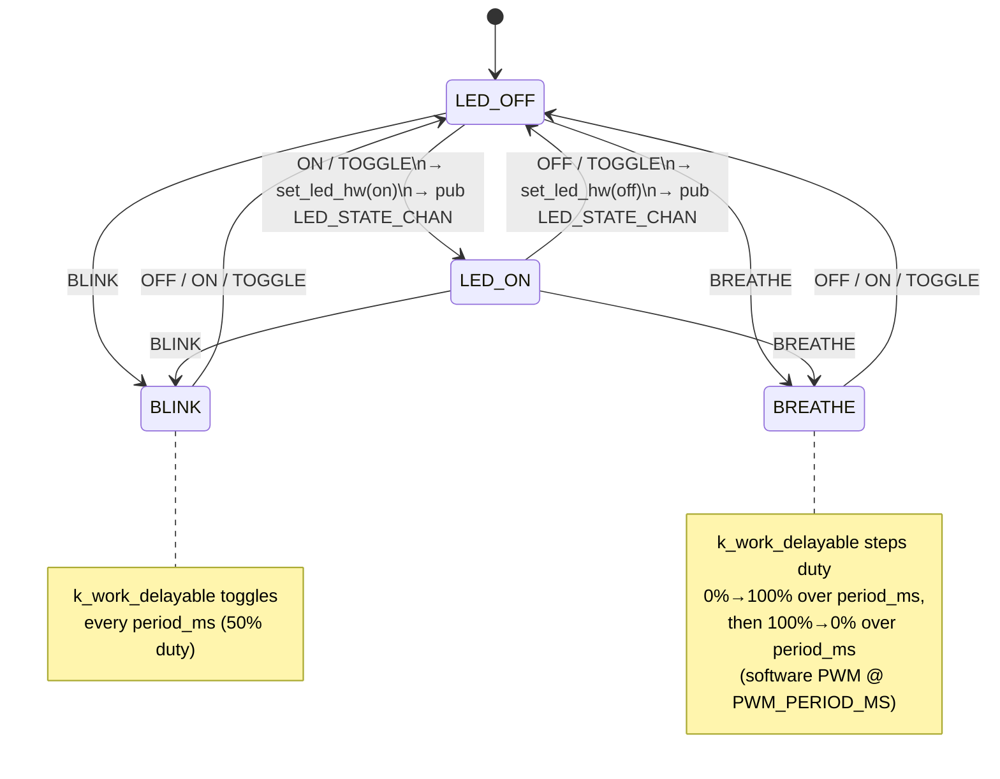

# LED Module Specification

## Document Information

| Field | Value |
|-------|-------|
| Module | `zego/led` |
| Version | 2026-06-01-13-27 |
| PRD Version | N/A (standalone library module) |
| Status | Stable |

---

## Changelog

| Version | Summary of changes |
|---|---|
| 2026-05-31-00-00 | Initial module spec (ON/OFF/TOGGLE/BLINK/BREATHE/MARQUEE) |
| 2026-06-01-13-27 | Breathe reworked: linear software-PWM ramp (0%→100%→0%) replaces asymmetric duty cycle; added `BREATHE_PWM_PERIOD_MS`; added sample app; removed test folder; reformatted to match button-spec structure |

---

## Overview

The `zego/led` module controls DK hardware LEDs via zbus commands.  Any application
module publishes a command to `LED_CMD_CHAN`; the LED module subscribes, drives a
per-LED SMF for static modes, and runs `k_work_delayable` timers for dynamic effects.
State changes are reported on `LED_STATE_CHAN`.

The LED module is a **pure command-driven module**: it consumes commands, produces
state notifications.  Policy (which events light which LED) lives in the application,
not in this module.

---

## Supported Hardware

| Board | Build target | LEDs available | Notes |
|-------|-------------|----------------|-------|
| nRF7002DK | `nrf7002dk/nrf5340/cpuapp` | LED1 (idx 0), LED2 (idx 1) | 2 LEDs |
| nRF54LM20DK | `nrf54lm20dk/nrf54lm20a/cpuapp` | LED0–LED3 (idx 0–3) | 4 LEDs |

---

## Location

- **Path**: `zego/led/`
- **Files**: `src/led.c`, `src/led.h`, `Kconfig`, `CMakeLists.txt`,
  `zephyr/module.yml`, `sample/`, `docs/`

---

## Module Type

- [x] **Application module** — zbus listener for `LED_CMD_CHAN`; per-LED SMF for
  static ON/OFF state; per-LED `k_work_delayable` for blink/breathe effects;
  global `k_work_delayable` for marquee.  Auto-initializes via `SYS_INIT`.

---

## Zbus Integration

**Subscribes to**: `LED_CMD_CHAN`

**Publishes to**: `LED_STATE_CHAN`

```c
enum led_msg_type {
    LED_COMMAND_ON,      /* Static: turn LED on                                          */
    LED_COMMAND_OFF,     /* Static: turn LED off                                         */
    LED_COMMAND_TOGGLE,  /* Static: invert current state                                 */
    LED_COMMAND_BLINK,   /* Effect: 50% duty cycle, toggles every period_ms              */
    LED_COMMAND_BREATHE, /* Effect: linear fade 0%→100% over period_ms, then 100%→0%    */
    LED_COMMAND_MARQUEE, /* Effect: one LED lit at a time, cycles at period_ms per step  */
};

struct led_msg {
    enum led_msg_type type;
    uint8_t  led_number; /* 0-based LED index; ignored for LED_COMMAND_MARQUEE           */
    uint16_t period_ms;  /* Effect period in ms; 0 = use Kconfig default                 */
};

struct led_state_msg {
    uint8_t led_number; /* 0-based LED index */
    bool    is_on;      /* New state after hardware change */
};
```

**`period_ms` semantics per command type:**

| Command | `period_ms` meaning | Default Kconfig |
|---------|---------------------|-----------------|
| `LED_COMMAND_BLINK` | Toggle half-period (full cycle = 2×) | `CONFIG_ZEGO_LED_BLINK_PERIOD_MS` (250 ms) |
| `LED_COMMAND_BREATHE` | Ramp duration per direction (full cycle = 2×) | `CONFIG_ZEGO_LED_BREATHE_PERIOD_MS` (3000 ms) |
| `LED_COMMAND_MARQUEE` | Time each LED stays lit per step | `CONFIG_ZEGO_LED_MARQUEE_PERIOD_MS` (300 ms) |
| Static commands | Ignored | — |

---

## State Machine (per LED)

Static commands (`ON`/`OFF`/`TOGGLE`) drive a two-state SMF.  Dynamic effect
commands (`BLINK`/`BREATHE`) cancel the SMF and run a per-LED `k_work_delayable`.
`MARQUEE` cancels all per-LED effects and runs a single global `k_work_delayable`.
Any static command cancels any active effect and returns the LED to SMF control.



**Effect descriptions:**

| Effect | Mechanism | Behaviour |
|--------|-----------|-----------|
| `BLINK` | `k_work_delayable` per LED | Toggles every `period_ms`; 50% duty cycle |
| `BREATHE` | `k_work_delayable` per LED | Software PWM: duty steps 0%→100% over `period_ms`, then 100%→0%. Steps = `period_ms` / `BREATHE_PWM_PERIOD_MS` |
| `MARQUEE` | Single global `k_work_delayable` | One LED lit at a time, advances every `period_ms`; pre-empts all per-LED effects |

---

## Kconfig Flags

| Symbol | Type | Default | Description |
|--------|------|---------|-------------|
| `CONFIG_ZEGO_LED` | bool | `n` | Enable the module |
| `CONFIG_ZEGO_LED_NUM_LEDS` | int | `4` | Number of LEDs; board overlays override |
| `CONFIG_ZEGO_LED_INIT_PRIORITY` | int | `91` | `SYS_INIT` APPLICATION level priority |
| `CONFIG_ZEGO_LED_LOG_LEVEL` | choice | `info` | Log verbosity |
| `CONFIG_ZEGO_LED_BLINK_PERIOD_MS` | int | `250` | Blink toggle half-period (ms); full cycle = 2× |
| `CONFIG_ZEGO_LED_BREATHE_PERIOD_MS` | int | `3000` | Breathe ramp duration per direction (ms); full cycle = 2× |
| `CONFIG_ZEGO_LED_BREATHE_PWM_PERIOD_MS` | int | `20` | Software-PWM frame size for breathe (ms); steps per ramp = PERIOD/PWM |
| `CONFIG_ZEGO_LED_MARQUEE_PERIOD_MS` | int | `500` | Time each LED stays lit during marquee (ms) |

Board-specific defaults (`boards/<board>.conf`):

| Board | `NUM_LEDS` |
|-------|-----------|
| `nrf7002dk/nrf5340/cpuapp` | 2 |
| `nrf54lm20dk/nrf54lm20a/cpuapp` | 4 |

---

## API / Public Interface

```c
/* Declared in src/led.h; available to consumers */

/* Channel declarations */
ZBUS_CHAN_DECLARE(LED_CMD_CHAN);    /* publish here to command an LED  */
ZBUS_CHAN_DECLARE(LED_STATE_CHAN);  /* subscribe to observe LED changes */

/* Query current state (reads SMF internal state, not hardware) */
int led_get_state(uint8_t led_number, bool *state);
/* Returns 0 on success, -EINVAL for out-of-range index or NULL pointer */
```

**Integration pattern:**

```c
#include "led.h"  /* path added by CMakeLists.txt include */

/* Static ON/OFF */
struct led_msg on  = { .type = LED_COMMAND_ON,  .led_number = 0 };
struct led_msg off = { .type = LED_COMMAND_OFF, .led_number = 0 };
zbus_chan_pub(&LED_CMD_CHAN, &on,  K_NO_WAIT);
zbus_chan_pub(&LED_CMD_CHAN, &off, K_NO_WAIT);

/* Blink LED 0 at 2 Hz (250 ms on, 250 ms off) */
struct led_msg blink = { .type = LED_COMMAND_BLINK, .led_number = 0, .period_ms = 250 };
zbus_chan_pub(&LED_CMD_CHAN, &blink, K_NO_WAIT);

/* Breathe LED 1: 3 s ramp up + 3 s ramp down = 6 s full cycle */
struct led_msg breathe = { .type = LED_COMMAND_BREATHE, .led_number = 1 };
zbus_chan_pub(&LED_CMD_CHAN, &breathe, K_NO_WAIT);

/* Marquee all LEDs at 200 ms per step */
struct led_msg marquee = { .type = LED_COMMAND_MARQUEE, .period_ms = 200 };
zbus_chan_pub(&LED_CMD_CHAN, &marquee, K_NO_WAIT);

/* Stop any effect */
struct led_msg stop = { .type = LED_COMMAND_OFF, .led_number = 0 };
zbus_chan_pub(&LED_CMD_CHAN, &stop, K_NO_WAIT);
```

Register the module in `CMakeLists.txt` before `find_package(Zephyr ...)`:

```cmake
get_filename_component(ZEGO_LED_DIR ${CMAKE_CURRENT_SOURCE_DIR}/../zego/led REALPATH)
list(APPEND EXTRA_ZEPHYR_MODULES ${ZEGO_LED_DIR})
```

Enable in `prj.conf`:

```
CONFIG_ZEGO_LED=y
```

---

## Error Handling

| Error Condition | Detection | Response |
|----------------|-----------|----------|
| `dk_leds_init` fails | Non-zero return in `led_module_init` | `LOG_ERR`, return error code (boot continues) |
| `zbus_chan_pub` (LED_STATE_CHAN) fails | Non-zero return in `publish_state` | `LOG_ERR`, notification dropped |
| Out-of-range LED number in command | `msg->led_number >= NUM_LEDS` | `LOG_WRN`, command silently ignored |
| Out-of-range `led_get_state` index | `led_number >= NUM_LEDS` | Return `-EINVAL` |
| NULL `state` pointer in `led_get_state` | `state == NULL` | Return `-EINVAL` |

---

## Memory Estimate

| Resource | Value | Notes |
|----------|-------|-------|
| Flash | ~3 KB | Code + effect handlers + read-only state table |
| RAM (static) | ~`NUM_LEDS × 40` bytes + 12 bytes | Per-LED `led_sm_object` structs + global marquee state |
| Stack | None | Runs on system work queue (no dedicated thread) |

---

## Test Points

| Scenario | UART log expected | Level |
|----------|-------------------|-------|
| Module init | `[zego_led] Initializing zego_led (N LEDs)` | INF |
| Module init complete | `[zego_led] zego_led initialized` | INF |
| LED turned on | `[zego_led] LED N ON` | DBG |
| LED turned off | `[zego_led] LED N OFF` | DBG |
| Blink started | `[zego_led] LED N BLINK period=X ms` | INF |
| Breathe started | `[zego_led] LED N BREATHE ramp=X ms (N steps x M ms/step)` | INF |
| Breathe direction reversal | `[zego_led] LED N BREATHE direction -> UP/DOWN (step X/Y)` | DBG |
| Marquee started | `[zego_led] Marquee started (period N ms)` | INF |
| Invalid LED number | `[zego_led] Invalid LED number: N (max M)` | WRN |
| LED_STATE_CHAN publish error | `[zego_led] Failed to publish LED_STATE_CHAN (led N): E` | ERR |

---

## Testing

### Hardware (real board)

Build and flash `sample/` on a supported board, then follow the step-by-step
test protocol in [`sample/README.md`](../sample/README.md).

| Step | Effect | LED(s) | Pass condition |
|------|--------|--------|----------------|
| T1 | Static ON/OFF | all, in sequence | Each LED on 600 ms then off; no LED stays on longer than ~600 ms |
| T2 | TOGGLE | LED 0 | 4 blinks at ~400 ms, ends off |
| T3 | BLINK | LED 0 | Steady 2 Hz (250 ms half-period); visually equal on/off |
| T4 | BREATHE | LED 0 | Gradually brightens over 3 s, then dims over 3 s; on-pulses visibly grow then shrink |
| T5 | MARQUEE | all | Exactly one LED lit at a time, advances left-to-right |

---
*(Changelog is maintained at the top of this document.)*
