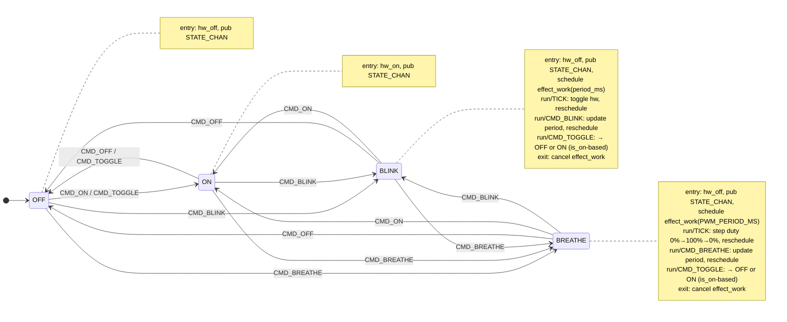
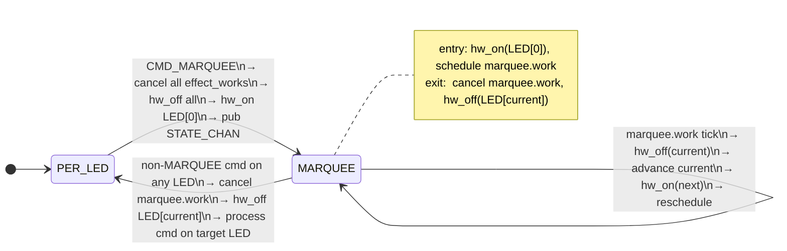

# LED Module Specification

## Document Information

| Field | Value |
|-------|-------|
| Module | `zego/led` |
| Version | 2026-06-04-00-00 |
| PRD Version | N/A (standalone library module) |
| Status | Stable |

---

## Changelog

| Version | Summary of changes |
|---|---|
| 2026-05-31-00-00 | Initial module spec (ON/OFF/TOGGLE/BLINK/BREATHE/MARQUEE) |
| 2026-06-01-13-27 | Breathe reworked: linear software-PWM ramp (0%→100%→0%) replaces asymmetric duty cycle; added `BREATHE_PWM_PERIOD_MS`; added sample app; removed test folder; reformatted to match button-spec structure |
| 2026-06-02-11-38 | Hardware abstraction layer (`led_hw.h` + DK / Zephyr-LED backends); hardware-PWM breathe path for boards with PWM LEDs (`CONFIG_ZEGO_LED_USE_PWM`); `LED_STATE_CHAN` now publishes once per effect start, not per toggle; added `command` field to `led_state_msg`; thread-safe `atomic_t` effect state; T6 HW-PWM breathe test step in sample |
| 2026-06-04-00-00 | **Full SMF redesign**: BLINK, BREATHE, and MARQUEE are now proper SMF states (no bypass); zbus listener decoupled from SMF via `k_msgq` + `k_work` so all SMF transitions run on the system workqueue; `atomic_t` effect field removed; `CONFIG_ZEGO_LED_CMD_QUEUE_DEPTH` added; Mermaid state diagrams added |

---

## Overview

The `zego/led` module controls hardware LEDs via zbus commands.  Any application
module publishes a command to `LED_CMD_CHAN`; the LED module subscribes, drives a
per-LED SMF for static modes, and runs `k_work_delayable` timers for dynamic effects.
State changes are reported on `LED_STATE_CHAN`.

The LED module is a **pure command-driven module**: it consumes commands, produces
state notifications.  Policy (which events light which LED) lives in the application,
not in this module.

A **hardware abstraction layer** (`led_hw.h`) decouples the effects engine from the
physical LED driver.  Choose a backend via Kconfig:

| Backend | Kconfig symbol | Description |
|---------|----------------|-------------|
| DK library (default) | `CONFIG_ZEGO_LED_BACKEND_DK=y` | Uses `dk_buttons_and_leds`; works out-of-the-box on nRF7002DK and nRF54LM20DK |
| Zephyr LED (portable) | `CONFIG_ZEGO_LED_BACKEND_ZEPHYR=y` | Uses Zephyr `gpio-leds` + optional `pwm-leds` drivers; portable to any board with a `gpio-leds` DTS node |

When `CONFIG_ZEGO_LED_BACKEND_ZEPHYR=y` is combined with `CONFIG_ZEGO_LED_USE_PWM=y`,
the breathe effect uses hardware PWM for LEDs that have a corresponding `pwm-leds`
child node (configured per-LED with `CONFIG_ZEGO_LED_n_PWM_INDEX`), and falls back to
software PWM for LEDs without a PWM channel.

---

## Supported Hardware

| Board | Build target | LEDs available | Notes |
|-------|-------------|----------------|-------|
| nRF7002DK | `nrf7002dk/nrf5340/cpuapp` | LED1 (idx 0), LED2 (idx 1) | 2 LEDs |
| nRF54LM20DK | `nrf54lm20dk/nrf54lm20a/cpuapp` | LED0–LED3 (idx 0–3) | 4 LEDs |

---

## Location

- **Path**: `zego/led/`
- **Files**: `src/led.c`, `src/led.h`, `src/led_hw.h` (HAL interface),
  `src/led_hw_dk.c` (DK backend), `src/led_hw_zephyr.c` (Zephyr LED backend),
  `Kconfig`, `CMakeLists.txt`, `zephyr/module.yml`, `sample/`, `docs/`

---

## Module Type

- [x] **Application module** — zbus listener enqueues commands to a `k_msgq`;
  a `k_work` on the system workqueue dequeues and drives a full per-LED Zephyr SMF
  (OFF / ON / BLINK / BREATHE).  A module-level marquee controller shares the same
  workqueue for `k_work_delayable` scheduling.  Hardware calls routed through
  `led_hw.h` HAL (DK or Zephyr LED driver backend).  Auto-initializes via `SYS_INIT`.

---

## Zbus Integration

**Subscribes to**: `LED_CMD_CHAN`

**Publishes to**: `LED_STATE_CHAN`

```c
enum led_msg_type {
    LED_COMMAND_ON,      /* Static: turn LED on                                          */
    LED_COMMAND_OFF,     /* Static: turn LED off                                         */
    LED_COMMAND_TOGGLE,  /* Static: invert current state                                 */
    LED_COMMAND_BLINK,   /* Effect: 50% duty cycle, toggles every period_ms              */
    LED_COMMAND_BREATHE, /* Effect: linear fade 0%→100% over period_ms, then 100%→0%    */
    LED_COMMAND_MARQUEE, /* Effect: one LED lit at a time, cycles at period_ms per step  */
};

struct led_msg {
    enum led_msg_type type;
    uint8_t  led_number; /* 0-based LED index; ignored for LED_COMMAND_MARQUEE           */
    uint16_t period_ms;  /* Effect period in ms; 0 = use Kconfig default                 */
};

struct led_state_msg {
    uint8_t          led_number; /* 0-based LED index (MARQUEE: first lit LED)    */
    bool             is_on;      /* true = on / effect running; false = off        */
    enum led_msg_type command;   /* Command that triggered this notification       */
};
```

**`LED_STATE_CHAN` publish policy:**

| Event | Published when | `is_on` | `command` |
|-------|---------------|---------|-----------|
| `LED_COMMAND_ON` | LED turned on | `true` | `LED_COMMAND_ON` |
| `LED_COMMAND_OFF` | LED turned off | `false` | `LED_COMMAND_OFF` |
| `LED_COMMAND_TOGGLE` | LED state changes | reflects new state | `LED_COMMAND_TOGGLE` |
| `LED_COMMAND_BLINK` | Effect **starts** (once) | `false` (LED off before first toggle) | `LED_COMMAND_BLINK` |
| `LED_COMMAND_BREATHE` | Effect **starts** (once) | `false` (LED off; ramps up from 0%) | `LED_COMMAND_BREATHE` |
| `LED_COMMAND_MARQUEE` | Effect **starts** (once) | `true` (first LED immediately lit) | `LED_COMMAND_MARQUEE` |

> **Note:** Dynamic effects (BLINK, BREATHE, MARQUEE) publish to `LED_STATE_CHAN` only
> once when the effect begins, **not** on every hardware toggle.  This prevents the
> channel from flooding subscribers with hundreds of events during a breathe cycle.

**`period_ms` semantics per command type:**

| Command | `period_ms` meaning | Default Kconfig |
|---------|---------------------|-----------------|
| `LED_COMMAND_BLINK` | Toggle half-period (full cycle = 2×) | `CONFIG_ZEGO_LED_BLINK_PERIOD_MS` (250 ms) |
| `LED_COMMAND_BREATHE` | Ramp duration per direction (full cycle = 2×) | `CONFIG_ZEGO_LED_BREATHE_PERIOD_MS` (3000 ms) |
| `LED_COMMAND_MARQUEE` | Time each LED stays lit per step | `CONFIG_ZEGO_LED_MARQUEE_PERIOD_MS` (300 ms) |
| Static commands | Ignored | — |

---

## State Machine

### Per-LED SMF

Each LED has an independent 4-state Zephyr SMF.  All four states — including the
dynamic effects BLINK and BREATHE — are proper SMF states with defined entry, run,
and exit actions.  Effects no longer bypass the SMF.



**State descriptions:**

| State | HW on? | Entry action | Run action | Exit action |
|-------|--------|--------------|------------|-------------|
| `OFF` | No | `hw_off`, pub `LED_STATE_CHAN` | Handle CMD_ON / CMD_TOGGLE / CMD_BLINK / CMD_BREATHE | — |
| `ON` | Yes | `hw_on`, pub `LED_STATE_CHAN` | Handle CMD_OFF / CMD_TOGGLE / CMD_BLINK / CMD_BREATHE | — |
| `BLINK` | Alternates | `hw_off`, pub `LED_STATE_CHAN`, schedule `effect_work` | TICK: toggle + reschedule; CMD_BLINK: update period + reschedule; CMD: transition to target state | Cancel `effect_work` |
| `BREATHE` | Fading | `hw_off`, pub `LED_STATE_CHAN`, schedule `effect_work` | TICK: advance duty step + reschedule; CMD_BREATHE: update period + reschedule; CMD: transition to target state | Cancel `effect_work` |

**Events delivered to the SMF `run` handler:**

| Event | Source | Set via |
|-------|--------|---------|
| `LED_EVENT_CMD` | `led_cmd_work_fn` (drains `led_cmd_queue`) | `sm->event = LED_EVENT_CMD; sm->cmd = *msg` |
| `LED_EVENT_TICK` | `effect_work_fn` timer callback | `sm->event = LED_EVENT_TICK` |

### Module-level MARQUEE Control

MARQUEE is a module-level mode tracked by a `marquee.active` flag.  When active,
the marquee stepper has exclusive control of all LED hardware; per-LED effect timers
are cancelled.  Per-LED SMFs retain their state while MARQUEE runs — they resume
when MARQUEE ends and the next command arrives.



### Command Dispatch Architecture

The zbus listener runs synchronously in the **publisher's thread** (which may be
the net_mgmt thread, a BLE stack thread, or any other Zephyr thread).  Calling
`k_work_cancel_delayable` or `k_work_schedule` from an arbitrary thread races with
the effect `k_work_delayable` callbacks on the system workqueue, corrupting the
kernel timeout dlist and causing a BUS FAULT in `sys_clock_announce`.

The redesign eliminates this race by decoupling the zbus listener from the SMF:

```mermaid
sequenceDiagram
    participant P  as Publisher (any thread)
    participant L  as led_cmd_listener (zbus, sync)
    participant Q  as led_cmd_queue (k_msgq)
    participant W  as led_cmd_work (system workqueue)
    participant S  as Per-LED SMF (system workqueue)
    participant E  as effect_work / marquee.work (system workqueue)

    P->>L:  zbus_chan_pub(LED_CMD_CHAN)
    L->>Q:  k_msgq_put (non-blocking; drops if full)
    L->>W:  k_work_submit
    Note over L: listener returns immediately

    W->>Q:  k_msgq_get (drain all pending)
    W->>S:  process_led_command() → smf_run_state()
    S->>E:  SMF entry: k_work_schedule (effect_work / marquee.work)
    Note over W,E: all on system workqueue → serialised, no race

    E->>S:  effect tick: LED_EVENT_TICK → smf_run_state()
    S->>E:  SMF run: k_work_schedule (reschedule next tick)
    S-->>E: SMF exit: k_work_cancel_delayable (safe: same thread)
```

> **Invariant:** All calls to `k_work_schedule` and `k_work_cancel_delayable` on
> `effect_work` and `marquee.work` happen exclusively on the system workqueue, where
> they are serialised with the timer callbacks themselves — no timeout dlist race.

---

## Kconfig Flags

| Symbol | Type | Default | Description |
|--------|------|---------|-------------|
| `CONFIG_ZEGO_LED` | bool | `n` | Enable the module |
| `CONFIG_ZEGO_LED_BACKEND_DK` | bool | `y` | Hardware backend: `dk_buttons_and_leds` (default) |
| `CONFIG_ZEGO_LED_BACKEND_ZEPHYR` | bool | `n` | Hardware backend: Zephyr `gpio-leds` / `pwm-leds` (portable) |
| `CONFIG_ZEGO_LED_CMD_QUEUE_DEPTH` | int | `8` | Max commands buffered between zbus listener and SMF worker; increase if bursts cause dropped commands |
| `CONFIG_ZEGO_LED_USE_PWM` | bool | `n` | Enable hardware-PWM breathe (requires `BACKEND_ZEPHYR`) |
| `CONFIG_ZEGO_LED_0_PWM_INDEX` | int | `-1` | `pwm-leds` child index for LED 0; `-1` = SW PWM fallback |
| `CONFIG_ZEGO_LED_1_PWM_INDEX` | int | `-1` | `pwm-leds` child index for LED 1; `-1` = SW PWM fallback |
| `CONFIG_ZEGO_LED_2_PWM_INDEX` | int | `-1` | `pwm-leds` child index for LED 2; `-1` = SW PWM fallback |
| `CONFIG_ZEGO_LED_3_PWM_INDEX` | int | `-1` | `pwm-leds` child index for LED 3; `-1` = SW PWM fallback |
| `CONFIG_ZEGO_LED_NUM_LEDS` | int | `4` | Number of LEDs; board conf overrides |
| `CONFIG_ZEGO_LED_INIT_PRIORITY` | int | `91` | `SYS_INIT` APPLICATION level priority |
| `CONFIG_ZEGO_LED_LOG_LEVEL` | choice | `info` | Log verbosity |
| `CONFIG_ZEGO_LED_BLINK_PERIOD_MS` | int | `250` | Blink toggle half-period (ms); full cycle = 2× |
| `CONFIG_ZEGO_LED_BREATHE_PERIOD_MS` | int | `3000` | Breathe ramp duration per direction (ms); full cycle = 2× |
| `CONFIG_ZEGO_LED_BREATHE_PWM_PERIOD_MS` | int | `20` | Software-PWM frame size for breathe (ms); steps per ramp = PERIOD/PWM |
| `CONFIG_ZEGO_LED_MARQUEE_PERIOD_MS` | int | `500` | Time each LED stays lit during marquee (ms) |

Board-specific defaults (`boards/<board>.conf`):

| Board | `NUM_LEDS` |
|-------|-----------|
| `nrf7002dk/nrf5340/cpuapp` | 2 |
| `nrf54lm20dk/nrf54lm20a/cpuapp` | 4 |

---

## API / Public Interface

```c
/* Declared in src/led.h; available to consumers */

/* Channel declarations */
ZBUS_CHAN_DECLARE(LED_CMD_CHAN);    /* publish here to command an LED  */
ZBUS_CHAN_DECLARE(LED_STATE_CHAN);  /* subscribe to observe LED changes */

/* Query current state (reads SMF internal state, not hardware) */
int led_get_state(uint8_t led_number, bool *state);
/* Returns 0 on success, -EINVAL for out-of-range index or NULL pointer */
```

**Integration pattern:**

```c
#include "led.h"  /* path added by CMakeLists.txt include */

/* Static ON/OFF */
struct led_msg on  = { .type = LED_COMMAND_ON,  .led_number = 0 };
struct led_msg off = { .type = LED_COMMAND_OFF, .led_number = 0 };
zbus_chan_pub(&LED_CMD_CHAN, &on,  K_NO_WAIT);
zbus_chan_pub(&LED_CMD_CHAN, &off, K_NO_WAIT);

/* Blink LED 0 at 2 Hz (250 ms on, 250 ms off) */
struct led_msg blink = { .type = LED_COMMAND_BLINK, .led_number = 0, .period_ms = 250 };
zbus_chan_pub(&LED_CMD_CHAN, &blink, K_NO_WAIT);

/* Breathe LED 1: 3 s ramp up + 3 s ramp down = 6 s full cycle */
struct led_msg breathe = { .type = LED_COMMAND_BREATHE, .led_number = 1 };
zbus_chan_pub(&LED_CMD_CHAN, &breathe, K_NO_WAIT);

/* Marquee all LEDs at 200 ms per step */
struct led_msg marquee = { .type = LED_COMMAND_MARQUEE, .period_ms = 200 };
zbus_chan_pub(&LED_CMD_CHAN, &marquee, K_NO_WAIT);

/* Stop any effect */
struct led_msg stop = { .type = LED_COMMAND_OFF, .led_number = 0 };
zbus_chan_pub(&LED_CMD_CHAN, &stop, K_NO_WAIT);
```

Register the module in `CMakeLists.txt` before `find_package(Zephyr ...)`:

```cmake
get_filename_component(ZEGO_LED_DIR ${CMAKE_CURRENT_SOURCE_DIR}/../zego/led REALPATH)
list(APPEND EXTRA_ZEPHYR_MODULES ${ZEGO_LED_DIR})
```

Enable in `prj.conf`:

```
CONFIG_ZEGO_LED=y
```

---

## Error Handling

| Error Condition | Detection | Response |
|----------------|-----------|----------|
| `led_hw_init` fails | Non-zero return in `led_module_init` | `LOG_ERR`, return error code (boot continues) |
| `zbus_chan_pub` (LED_STATE_CHAN) fails | Non-zero return in `publish_state` | `LOG_ERR`, notification dropped |
| Out-of-range LED number in command | `msg->led_number >= NUM_LEDS` | `LOG_WRN`, command silently ignored |
| Out-of-range `led_get_state` index | `led_number >= NUM_LEDS` | Return `-EINVAL` |
| NULL `state` pointer in `led_get_state` | `state == NULL` | Return `-EINVAL` |

---

## Memory Estimate

| Resource | Value | Notes |
|----------|-------|-------|
| Flash | ~3 KB | Code + effect handlers + read-only state table |
| RAM (static) | ~`NUM_LEDS × 40` bytes + 12 bytes | Per-LED `led_sm_object` structs + global marquee state |
| Stack | None | Runs on system work queue (no dedicated thread) |

---

## Test Points

| Scenario | UART log expected | Level |
|----------|-------------------|-------|
| Module init | `[zego_led] Initializing zego_led (N LEDs)` | INF |
| Module init complete | `[zego_led] zego_led initialized` | INF |
| LED turned on | `[zego_led] LED N ON` | DBG |
| LED turned off | `[zego_led] LED N OFF` | DBG |
| Blink started | `[zego_led] LED N BLINK period=X ms` | INF |
| Breathe started (SW PWM) | `[zego_led] LED N BREATHE (SW PWM) ramp=X ms (N steps x M ms/step)` | INF |
| Breathe started (HW PWM) | `[zego_led] LED N BREATHE (HW PWM) ramp=X ms (N steps x M ms/step)` | INF |
| Breathe direction reversal | `[zego_led] LED N BREATHE direction -> UP/DOWN (step X/Y)` | DBG |
| Marquee started | `[zego_led] Marquee started (period N ms)` | INF |
| Invalid LED number | `[zego_led] Invalid LED number: N (max M)` | WRN |
| LED_STATE_CHAN publish error | `[zego_led] Failed to publish LED_STATE_CHAN (led N): E` | ERR |

---

## Testing

### Hardware (real board)

Build and flash `sample/` on a supported board, then follow the step-by-step
test protocol in [`sample/README.md`](../sample/README.md).

| Step | Effect | LED(s) | Pass condition |
|------|--------|--------|----------------|
| T1 | Static ON/OFF | all, in sequence | Each LED on 600 ms then off; no LED stays on longer than ~600 ms |
| T2 | TOGGLE | LED 0 | 4 blinks at ~400 ms, ends off |
| T3 | BLINK | LED 0 | Steady 2 Hz (250 ms half-period); visually equal on/off |
| T4 | BREATHE | LED 0 | Gradually brightens over 3 s (SW PWM by default), then dims; on-pulses visibly grow then shrink |
| T5 | MARQUEE | all | Exactly one LED lit at a time, advances left-to-right |
| T6 | BREATHE (HW PWM) | each LED in sequence | Requires `CONFIG_ZEGO_LED_USE_PWM=y`; module log shows `(HW PWM)` for LEDs with `PWM_INDEX >= 0` and `(SW PWM)` fallback for others. HW PWM LEDs show true analogue fade; SW fallback shows rapid toggling |

---
*(Changelog is maintained at the top of this document.)*
